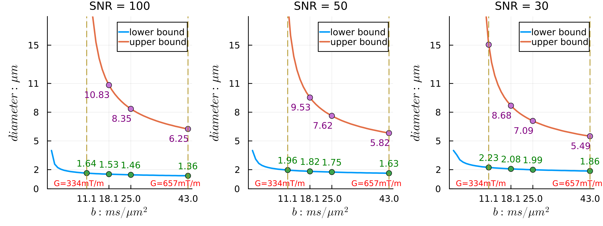

# [Sensitivity range of axon diameter index] (@id guide-sensitivity)

When estimating axon diameter indices from MRI data, the sensitivity range of such estimates is closely associated with experimental factors, such as gradient strength and diffusion times, and tissue properties such as the intrinsic diffusivity. Therefore, evaluation of experimental settings is important for understanding the validity of the axon diameter index. Following the sensitivity criterion for the PA signal introduced by previous studies (Andersson et al., 2022; Nilsson et al., 2017), we can conveniently calculate the sensitivity range of axon diameter index estimates obtained from Microstructure.jl. 

## For single high b-value
The sensitivity criterion concerns whether the normalized signal along a single gradient can be differentiated from the noise floor and the maximum signal. The smallest measurable signal attenuation ``\overline{σ}`` relates to the SNR level of the signal as follows:

```math
\overline{σ} =  \frac{z_α}{SNR\sqrt{n}},
```

where ``n`` is the number of measurements and ``z_α`` is the z-threshold for the significance level ``α `` (``z_α = 1.64`` when ``α = 0.05``). The PA signal from a Cylinder compartment is upper bounded by a Cylinder with zero diameter, which is equal to the Stick model signal. A Cylinder therefore has a measurable diameter if its PA signal falls within the range of ``[\overline{σ}, S_{stick} - \overline{σ}]``. Given a single b-value, the lower and upper bounds of axon diameter are thus the minimal diameter that gives ``S_{cylinder}`` smaller than ``S_{stick} - \overline{σ}`` and maximal diameter that gives ``S_{cylinder}`` above ``\overline{σ}``.

We start by using the packages we need:

```julia
# We use Microstructure.jl for sensitivity analysis and other libraries for visualization 
using Microstructure
using Plots
using LaTeXStrings
using Plots.PlotMeasures
```

Based on the sensitivity criterion, we can define the following function to calculate the sensitivity range for a given high b-value measurement:

```julia
"""
Calculate the sensitivity range for axon diameter index with PA signal from a single b-value.
Inputs: 
    SNR: SNR level of data
    n: the number of unique gradient directions for the b-value measurements
    bval: b-value
    tdelta: gradient seperation time
    tsmalldel: gradient duration time
    d0: the intrinsic diffusivity within intra-axonal compartment
Outputs:
    lower bound (m), upper bound (m), G (T/m)
"""

function axon_da_sensitivity(SNR, n, bval, tdelta, tsmalldel, d0)
    za = 1.64
    sigma = za ./ SNR ./ sqrt.(n)

    # make a Protocol type object from the single-b measurement
    prot = Protocol([bval], zeros(length(bval)), [tdelta], [tsmalldel])
    
    # generate signals from a Stick compartment and the protocol
    Sstick = compartment_signals(Stick(; dpara=d0), prot)

    # maximal signal
    upperb = Sstick[1] - sigma

    # the range of diameter indices for searching the lower and upper bounds
    range_lb = 0.5e-6:0.01e-6:4.0e-6
    range_ub = 5.0e-6:0.01e-6:20.0e-6

    cyl = Cylinder(; dpara=d0, d0=d0)
    for ia in eachindex(range_lb)
        cyl.da = range_lb[ia]
        signal = compartment_signals(cyl, prot)
        signal[1] < upperb && break
    end
    da_min = cyl.da

    for ia in eachindex(range_ub)
        cyl.da = range_ub[ia]
        signal = compartment_signals(cyl, prot)
        signal[1] < sigma && break
    end

    da_max = cyl.da
    return da_min, da_max, prot.gvec[1]
end
```

An example call of the function that returns (1.76e-6, 5.63e-6, 0.6576631887436215), meaning sensitivity range of [1.76, 5.63] 𝜇m at G ≈ 658 mT/m (The package uses standard unit for computation):
```julia
axon_da_sensitivity(37, 32, 43.0*1e9, 15.192e-3, 11.0e-3, 0.6*1e-9)
```

To visualize the sensitivity ranges for different protocols, we define a function to plot the sensitivity profile from several b-values (G) with same diffusion times:

```julia

"""
Visulize the sensitivity profile of axon diameter given several b-values
    call the axon_da_sensitivity function and plot figures
"""
function sensitivity_plot(SNR, d0, bval_mea, tdelta, tsmalldel, n = 32)

    da_min_mea = zeros(length(bval_mea))
    da_max_mea = zeros(length(bval_mea))
    g_mea = zeros(length(bval_mea))

    # calculate sensitivity range for given b-values in the protocol 
    for ib in eachindex(bval_mea)
        da_min_mea[ib], da_max_mea[ib], g_mea[ib] = axon_da_sensitivity(
            SNR, n, bval_mea[ib], tdelta, tsmalldel, d0
        )
    end

    # continous plots
    bval = (000.0 * 1.0e6):(1000.0 * 1.0e6):max(bval_mea...)
    da_min = zeros(length(bval))
    da_max = zeros(length(bval))
    G = zeros(length(bval))
    for ib in eachindex(bval)
        da_min[ib], da_max[ib], G[ib] = axon_da_sensitivity(
            SNR, n, bval[ib], tdelta, tsmalldel, d0
        )
    end

    xticks = bval_mea*1.0e-9
    xlabel = L"b: ms/{{\mu}m}^2"
    yticks = [0.0, 2.0, 5.0, 8.0, 11.0, 15.0]
    ylabel = L"diameter: {\mu}m"
    label = ["lower bound" "upper bound"]

    p = plot(
        bval*1.0e-9,
        [da_min, da_max]*1.0e6;
        xticks=xticks,
        xlabel=xlabel,
        yticks=yticks,
        ylabel=ylabel,
        label=label,
        legend=:topright,
        lw=2,
        ylims=(0, 18),
    )
    scatter!(bval_mea*1.0e-9, [da_min_mea, da_max_mea]*1.0e6; label=false)
    annotate!(
        bval_mea*1.0e-9,
        da_min_mea*1.0e6 .+ 1.5,
        text.(round.(da_min_mea*1.0e6; digits=2), :top, :green, 8),
    )
    annotate!(
        bval_mea[2:end]*1.0e-9,
        da_max_mea[2:end]*1.0e6 .- 1.0,
        text.(round.(da_max_mea[2:end]*1.0e6; digits=2), :right, :purple, 8),
    )

    vline!([xticks[1], xticks[end]]; line=(:dash), labels=false)
    annotate!(
        xticks[1]-2.5, 1, text("G="*string(round(Int, g_mea[1]*1000))*"mT/m", :top, 7, :red)
    )
    annotate!(
        xticks[end]-4,
        1,
        text("G="*string(round(Int, g_mea[end]*1000))*"mT/m", :top, 7, :red),
    )
    return p
end
```

The functions for visualizing sensitivity profiles are included as utility functions outside the package. You can use these functions by including the utility script in the package folder:

```julia
using Microstructure
srcpath = dirname(pathof(Microstructure))
include(joinpath(srcpath, "../utils/utils.jl"))
```

### Experiments
We calculate the sensitivity ranges of axon diameter estimation at different high b-values feasible on a 4.7 T preclinical scanner with maximum gradient strength Gmax = 660 mT/m.  We investigate the effects of diffusion time and b-value to sensitivity ranges by using different diffusion times that reach the Gmax with different b-values. We assume that the number of gradient directions is 32 and the ex vivo intrinsic diffusivity is 0.6 ``𝜇m^2/ms``. We consider SNR levels of 100, 50 and 30. 

Example for the median diffusion time:
```julia
# directory for saving figures
figdir = "/Users/tgong/Work/Projects/Microstructure.jl/demos/Toolbox/figures"
dpi = 600

# %%  evaluating protocol 2 
bval_mea = [11100, 18100, 25000, 43000] .* 1.0e6
tdelta = 15.2*1e-3
tsmalldel = 11.0 .* 1e-3

p1 = sensitivity_plot(100.0, 0.6e-9, bval_mea, tdelta, tsmalldel)
p2 = sensitivity_plot(50.0, 0.6e-9, bval_mea, tdelta, tsmalldel)
p3 = sensitivity_plot(30.0, 0.6e-9, bval_mea, tdelta, tsmalldel)

titles = ["SNR = 100" "SNR = 50" "SNR = 30"]
plot(
    p1,
    p2,
    p3;
    layout=(1, 3),
    titles=titles,
    titlefont=font(10),
    xlabel=L"b: ms/{{\mu}m}^2",
    #xlabel=L"b: ms/{{\mu}m}^2; {\delta}/{\Delta}=11/15.2ms",
    left_margin=5mm,
    bottom_margin=5mm,
    xguidefontsize=10,
    size=(800, 300),
    dpi=dpi,
)
savefig(figdir * "/1_sensitivity_dt15")
```

```@raw html
 
```

### Results
For the same diffusion time, the sensitivity range shifts towards smaller axons when the gradient
strength G and thus b-value increases, as seen in Figure 3(A-C) in our preprint. Higher gradient strengths yield sensitivity
to smaller axons, which are most abundant in tissue. However, they also reduce the sensitivity to very
large axons, e.g. axons with diameter > 7.5 𝜇m for G = 660 mT/m. For the same gradient strength G,
shorter diffusion time and therefore lower b-value widens the sensitivity range on both sides. For
example, see G≈ 660 mT/m, b = 25, 43 and 64 ``ms/𝜇m^2`` in Figure 3(A-C). For the same b-value, shorter diffusion
time and thus higher G lowers the lower bound of axon diameters that can be estimated accurately but
also reduces sensitivity to larger axons. This analysis suggests that using higher gradient strength and
shorter diffusion time to achieve lower b-values is preferable, as it achieves a wider sensitivity range that
covers most axon diameters expected in real tissue.

```@raw html
<embed src="../assets/package_demo/Figure3_sensitivity.pdf" width="800px" height="600px" />
```


## For multiple high b-values
The above analysis assumes measurements with a single bvalue.
If data are collected with multiple b-values that are sensitive to the practical range of axon
diameter in tissue, the lower and upper bounds of **``S_{cylinder}``** (corresponding to the upper and lower
bounds of axon diameter) become vectors [**``\overline{σ}``**, **``S_{stick}`` − ``\overline{σ}``**]. In this case, we can approximate the sensitivity range by finding the diameters that give minimal mean squared error (MSE) between their
signals and signal bounds across all shells. For estimating the upper bound of axon diameters, we use
only shells of high b-values because data with lower b-values can be sensitive to infinitely large axons,
and if included their signal contributions will dominate the calculation of MSE. Considering the three
high b-shells in Figure 3(B) for ex vivo imaging (b= 18.1, 25 and 43 ms/ 𝜇m2), the sensitivity ranges are
[1.42, 10.5], [1.70, 9.18], and [1.94, 8.32] 𝜇m for SNR level of 100, 50 and 30 respectively.

## References
Andersson, M., Pizzolato, M., Kjer, H.M., Skodborg, K.F., Lundell, H., Dyrby, T.B., 2022. Does powder averaging remove dispersion bias in diffusion MRI diameter estimates within real 3D axonal architectures? Neuroimage 248. https://doi.org/10.1016/j.neuroimage.2021.118718

Nilsson, M., Lasič, S., Drobnjak, I., Topgaard, D., Westin, C.F., 2017. Resolution limit of cylinder diameter estimation by diffusion MRI: The impact of gradient waveform and orientation dispersion. NMR Biomed 30. https://doi.org/10.1002/NBM.3711

