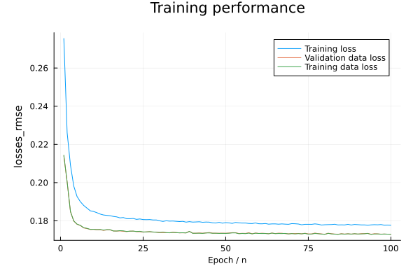

# [SMT] (@id guide-smt)

For a neural network estimator, the prior distribution of tissue parameters used for training the model will affect the posterior distributions of parameter estimates. Ideally an uninformative prior such as those used in the MCMC sampler will ensure that the estimates are less biased by prior knowledge and thus truly reflect biological properties. However, due to practical difficulties in parameter estimation, e.g., with limited data and low SNR, previous studies have used strategies such as fixing certain parameters and using narrower priors to increase the robustness of estimates. The Microstructure.jl package is designed to investigate these strategies flexibly, as the parameters to estimate in a model and the prior ranges and prior distributions are input arguments for training MLP models. It generates fitting evaluations for a fitting strategy given the protocol and SNR level in the data.  

This tutorial uses the SMT model (Kaden et al., 2016) for demonstration.

## Datasets
We used the minimally preprocessed datasets from the WashU/UMinn young adult Human Connectome Project (HCP) (Glasser et al., 2013; Van Essen et al., 2012) to demonstrate the fitting of a Stick-Zeppelin model appropriate for WM with the SMT. The HCP data were acquired at a 1.25 mm isotropic resolution with diffusion weightings of b=1000, 2000, and 3000 ``s/mm^2``, 90 directions per shell and 18 b=0 s/mm2 images interspersed uniformly between the DWIs, resulting in a total of 288 measurements. We used datasets from 6 subjects for evaluating the variation of estimates. 

## Experiments
The SMT model with single TE data is characterized by the intra-axonal signal fraction ``f_{ia}``, intra-axonal parallel diffusivity ``D_∥^{ia}``, extra-cellular parallel diffusivity ``D_∥^{ec}`` and extra-cellular perpendicular diffusivity ``D_⊥^{ec}``. This two-compartment SMT model (Kaden et al., 2016) originally assumed ``D_∥^{ec}=D_∥^{ia}=D_∥``  and linked ``D_⊥^{ec}`` through a model of tortuosity as ``D_⊥^{ec} = (1- f_{ia}) D_∥^{ec}``, thus reduced the model parameters to ``f_{ia}`` and ``D_∥``. Here, we removed the tortuosity assumption and estimated ``f_{ia}``, ``D_∥``  and ``D_⊥^{ec}`` from all three b-shells of the HCP data; ``D_⊥^{ec}`` was represented as ``D_∥^{ec} = D_∥`` multiplied by a fraction between [0, 1]. 

We generated 30,000 training samples with tissue parameters sampled from prior ranges of [0, 1] for ``f_{ia}`` and the ``D_⊥^{ec} / D_∥`` fraction, and [1, 3] ``𝜇m^2/ms`` for ``D_∥``. We used uniform distributions for sampling the ``f_{ia}`` and the ``D_⊥^{ec} / D_∥`` fraction. We tested both a uniform and a more informative Gaussian distribution for the ``D_∥``, with a mean value of 2 ``𝜇m^2/ms`` that is appropriate for WM tissue. We generated signals for the training samples using the forward model and the HCP imaging protocol and added Gaussian noise to the signals to generate noisy measurements.  

### Code example
The following code trains network on synthetic data with HCP protocol. We can visualize the training log before further evaluation of parameters:
```julia
using Fibers, Microstructure
using Distributions, Random
using Plots
using Flux

# set the path to save generated figures
figdir = "/Users/tgong/Work/Projects/Microstructure.jl/demos/Toolbox/figures/"
dpi = 600  # figure resoluton
info = "gaussian" # used in file name for saving; the case of using Gaussian prior

# %% read the data acquistion protocol to generate training data
datadir = "/Users/tgong/Work/Database/HCP/905147"
protocol = Protocol(joinpath(datadir, "diravg_norm.btable"))

### Setup model and nn estimator
# t2 is set to default as 0, so single-TE model will be used
model = MTE_SMT( 
    axon = Stick(dpara = 2.0e-9, t2 = 0.0),
    extra = Zeppelin(dpara = 2.0e-9, dperp_frac = 0.5, t2 = 0.0),
    fracs = 0.5,
    )

# parameters to estimate
params = ("fracs", "axon.dpara", "extra.dperp_frac")
prior_range = ((0.0, 1.0), (1.0e-9, 3.0e-9), (0.0, 1.0))

# Gaussian prior for "axon.dpara"
prior_dist = (nothing, Normal(2.0e-9, 0.3e-9), nothing)

paralinks = ("extra.dpara" => "axon.dpara")

# The level of the noise
noise_type = "Gaussian"
sigma_range = (0.002, 0.02)
sigma_dist = Normal(0.01, 0.002)

nsamples = 30000
nin = 4
nout = 3
hidden_layers = (32, 32, 32)
dropoutp = (0.1, 0.1, 0.1)

netarg = NetworkArg(
    model,
    protocol,
    params,
    prior_range,
    prior_dist,
    paralinks,
    noise_type,
    sigma_range,
    sigma_dist,
    nsamples,
    nin,
    nout,
    hidden_layers,
    dropoutp,
    relu6,
)
trainarg = TrainingArg(batchsize = 128, lossf=losses_rmse, device = cpu)

# get mlp and training data
mlp, logs, inputs, labels = training(trainarg, netarg)

# visualize training log
p = logs_plt(logs, trainarg)
```
```@raw html
 
```

We can then get the estimates on the synthetic data and use utility function to visualize the evaluation results:
```julia
# get probabilistic estimates for the training data for evaluation
ntest = 100    # the number of test times
posteriors = test(mlp, inputs, ntest) # posterior samples
est = mean(posteriors)      # mean
est_std = std(posteriors)   # standard deviation 

# get evaluation plot for each parameters in the model 
evalplots_mean, evalplots_std, para_range = eval_plt(netarg, est, est_std, labels)

# plotting evaluation 
titles = [L"f_{ia}" L"D_{\parallel}" L"D_{\perp}^{ec}"]
Plots.plot(
    evalplots_mean["fracs1"],
    evalplots_mean["axon.dpara"],
    evalplots_mean["extra.dperp"];
    layout=(1, 3),
    size=(900, 200),
    legend=:none,
    margin=5mm,
    xguidefontsize=8,
    yguidefontsize=10,
    titles=titles,
    xlabel=[L"GT " L"GT\ [{\mu}m^2/ms]" L"GT\ [{\mu}m^2/ms]"],
    ylabel=L"Estimates: Mean",
)

savefig(joinpath(figdir, "Eval_smt_3p_" * info * "_mean.pdf"))

Plots.plot(
    evalplots_std["fracs1"],
    evalplots_std["axon.dpara"],
    evalplots_std["extra.dperp"];
    layout=(1, 3),
    size=(900, 200),
    legend=:none,
    margin=5mm,
    xguidefontsize=8,
    yguidefontsize=10,
    titles=titles,
    xlabel=[L"GT " L"GT\ [{\mu}m^2/ms]" L"GT\ [{\mu}m^2/ms]"],
    ylabel=L"Std/Prior\ Range",
)

savefig(joinpath(figdir, "Eval_smt_3p_" * info * "_std.pdf"))
```

To apply the trained mlp to real data, we can use the `nn_estimate` function:
```julia
# apply trained mlp to real data
subjs = ("905147", "971160", "983773", "984472", "992774", "994273")
modelname = "smt.3p." * info * "."  # savename

for subj in subjs

    # read data and mask
    datadir = joinpath("/Users/tgong/Work/Database/HCP", subj)
    dmri = mri_read(joinpath(datadir, "diravg_norm.nii.gz"))
    mask = mri_read(joinpath(datadir, "nodif_brain_mask.nii"))

    # apply mlp to the data and save estimated parameter maps as nifti
    savedir = joinpath(datadir, "SMT")
    mkpath(savedir)
    nn_estimate(dmri, mask, mlp, netarg, ntest, savedir, modelname)
end
```

## Results
**Evaluation on synthetic data.** The Gaussian prior for ```D_∥```, with a mean value representative of WM tissue, improved the precision and reduced the uncertainty for the diffusivity measures. The estimation accuracy of ```f_{ia}``` was not affected much by the prior distributions of diffusivities. 

```@raw html
<embed src="../assets/package_demo/Figure8_SMT_eval.pdf" width="800px" height="300px" />
```
Effect of prior distribution on SMT model fitting with neural network estimator. Data were synthesized assuming the acquisition parameters of the HCP protocol and either uniform (A) or Gaussian (B) prior distribution for ``D_∥``. Samples of ``D_⊥^{ec}`` were generated by multiplying ``D_∥`` by random, uniformly distributed numbers between [0, 1].  (a) 2D histograms of ground truth (GT) values vs. estimates (posterior mean); (b) 2D histogram of GT vs. the ratio of the standard deviation (Std) of the posterior over the prior range; (c) distributions of parameters in the training samples/ground truth parameters. 


**Parameter map from one example subject.** The high uncertainty of ``f_{ia}`` caused by CSF contamination is highlighted by the high standard deviations in the posteriors. The reduced uncertainty of ``D_∥`` resulting from using a Gaussian prior is also evident from the uncertainty map. Distributions of parameter estimates in the WM from 6 subjects show high consistency. 

```@raw html
<embed src="../assets/package_demo/Figure9_SMT_map.pdf" width="800px" height="400px" />
```
SMT model fitting on in vivo human data. The trained models with (A) uniform and (B) Gaussian priors were used for inference on 6 randomly selected datasets from the WashU/UMinn young adult HCP. (a) Mean and standard deviation maps for estimates of different microstructural parameters from one subject. The high uncertainty caused by CSF contamination in ``f_{ia}`` is highlighted by the white arrows in both (A) and (B). The reduced uncertainty of ``D_{∥}`` when using a Gaussian prior is highlighted by the orange arrows. (b) Probability density of the estimates in WM shows high overlap across 6 subjects. 

## References
Kaden, E., Kelm, N.D., Carson, R.P., Does, M.D., Alexander, D.C., 2016. Multi-compartment microscopic diffusion imaging. Neuroimage 139, 346–359. https://doi.org/10.1016/J.NEUROIMAGE.2016.06.002

Glasser, M.F., Sotiropoulos, S.N., Wilson, J.A., Coalson, T.S., Fischl, B., Andersson, J.L., Xu, J., Jbabdi, S., Webster, M., Polimeni, J.R., Van Essen, D.C., Jenkinson, M., 2013. The minimal preprocessing pipelines for the Human Connectome Project. Neuroimage 80, 105–124. https://doi.org/10.1016/j.neuroimage.2013.04.127

Van Essen, D.C., Ugurbil, K., Auerbach, E., Barch, D., Behrens, T.E.J., Bucholz, R., Chang, A., Chen, L., Corbetta, M., Curtiss, S.W., Della Penna, S., Feinberg, D., Glasser, M.F., Harel, N., Heath, A.C., Larson-Prior, L., Marcus, D., Michalareas, G., Moeller, S., Oostenveld, R., Petersen, S.E., Prior, F., Schlaggar, B.L., Smith, S.M., Snyder, A.Z., Xu, J., Yacoub, E., 2012. The Human Connectome Project: A data acquisition perspective. Neuroimage. https://doi.org/10.1016/j.neuroimage.2012.02.018
